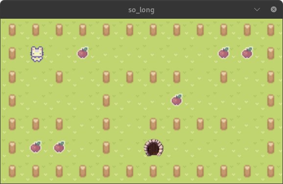

# 🎮 so_long – My tiny 2D game

Welcome to **so_long**, my **graphical 2D game in C**!  
It’s a **top-down 2D game** where you explore a map, collect items, and escape.  
Built with the **MiniLibX graphics library**, it’s simple, fun, and a great intro to event-driven programming.

---

## 🕹 Gameplay 
- You are the **kitty**.  
- Collect all the **apples**.  
- Find the **exit** and escape the map!  

---

## ✨ Features 
- **Map parsing** from `.ber` files (custom level files).  
- **Input handling** for player movement (WASD / arrows).  
- **Collision detection** so you can’t walk through walls.  
- **Step counter** shown in the terminal (because efficiency matters).  
- **Error handling** with clear messages if something goes wrong.  

---

## 💻 Technical Details
- Language: **C**  
- Graphics: **MiniLibX**
- Concepts used:
  - **Parsing & validation** of input files  
  - **2D arrays** for map storage  
  - **Event hooks** for keyboard and window events  
  - **Basic rendering** of sprites and textures  

---

## 🎹 Controls 
- `W` / `↑` – Move up  
- `A` / `←` – Move left  
- `S` / `↓` – Move down  
- `D` / `→` – Move right  
- `ESC` – Rage quit instantly 😅  

---

# How to play
- type `make` `map.ber` in the terminal
- MiniLibX library is required 

---

# Summary
**so_long** is a small but interesting **C game project**.  
It taught me **graphics programming, event handling, and game logic** — while keeping things fun and retro.  

